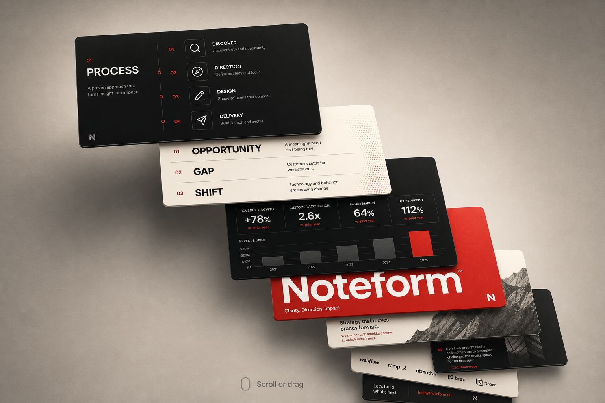

# Card Animation T1 — Indula Pitch Deck Stack

A pure HTML/CSS/JS cascading **3D pitch-deck card stack** — cards peel toward the camera, the stack cascades in depth, and the next slide rises from behind.



## What this is

**Indula** is a self-contained micro-demo of an editorial pitch deck UI. Eight 16:9 slides (process, opportunity, metrics, brand, intro, about, chapter covers) sit in a perspective stage and cycle with a smooth peel / cascade animation.

## Features

- **3D card stack** — `rotateX` / `rotateY` / `rotateZ` depth with stepped Y/Z offsets
- **Auto-play cascade** — front card lifts out; the rest advance; a new card enters from the back
- **Scroll & drag** — wheel or pointer drag to scrub through the stack; auto-play resumes after idle
- **Ambient sway** — subtle continuous motion so the stack feels alive
- **Responsive** — card size and layout adapt on smaller screens
- **Zero dependencies** — vanilla HTML, CSS, and JavaScript

## Quick start

Open the demo in a browser (no build step):

```bash
open indula/index.html
```

Or serve locally if you prefer:

```bash
cd indula
python3 -m http.server 8080
# then visit http://localhost:8080
```

## Project structure

```
├── README.md
├── preview.png          # README preview image
└── indula/
    ├── index.html       # Eight pitch-deck cards
    ├── css/style.css    # Scene, 3D stage, slide layouts
    ├── js/script.js     # Stack transforms, autoplay, scroll/drag
    └── assets/images/   # Slide media (monolith, portrait)
```

## How the animation works

1. Cards are ordered front → back in a stack.
2. Each frame interpolates every card between its current stack slot and the slot above it (eased with cubic in-out).
3. The front card peels up (lift + fade); deeper cards step forward in Y/Z; the last card eases in from further back.
4. When progress hits `1`, the order rotates and the cycle repeats.

Interaction pauses autoplay briefly; after you stop scrolling or dragging, autoplay kicks back in.

## Slide lineup

| # | Theme        | Style  |
|---|--------------|--------|
| 1 | Process      | Black  |
| 2 | Opportunity  | White  |
| 3 | Metrics      | Black  |
| 4 | Brand           | Red    |
| 5 | Soft metrics | White  |
| 6 | Introduction | Black  |
| 7 | About        | Red    |
| 8 | Metrics chapter | Red |

## License

Copyright © 2026 Mohamed Jemshith. All rights reserved.
